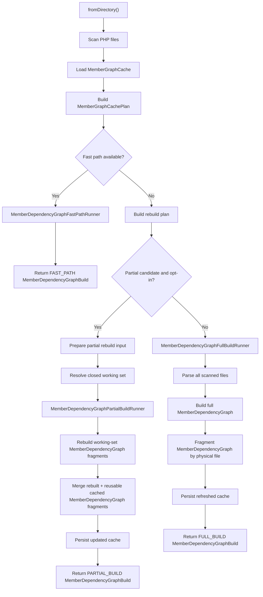

# Member Dependency Graph Factory

Navigation: [Back to README](README.md) | [Previous: Query Service](10-query-service.md) | [Next: Partial Rebuild Design](12-partial-rebuild-design.md)

`MemberDependencyGraphFactory` is the current entry point for building a `MemberDependencyGraph` from directories or from already loaded virtual files.

## Entry Point

The public entry point is:

```php
$build = MemberDependencyGraphFactory::fromDirectory(
    directories: ['/project/src'],
    cacheFilePath: '/project/var/member-graph.cache',
    excludedDirectories: ['/project/src/Generated'],
    clearCache: false,
);
```

Partial rebuild execution is opt-in and is the current changed-file cache path:

```php
$build = MemberDependencyGraphFactory::fromDirectory(
    directories: ['/project/src'],
    cacheFilePath: '/project/var/member-graph.cache',
    options: new MemberDependencyGraphFactoryOptions(enablePartialRebuild: true),
);
```

Without explicit options, partial rebuild candidates are still reported as dry-run data and executed through the full build path.

The factory can also rebuild a graph from an existing in-memory virtual-file collection:

```php
$freshBuild = MemberDependencyGraphFactory::fromVirtualFiles(
    virtualFiles: $build->virtualFiles,
);
```

This entry point is intended for transactional workflows that already mutated PHPParser nodes inside `VirtualPhpSourceFile` instances.
It returns a normal `MemberDependencyGraphBuild`, so the result can be passed to source-node, impact, query, and symbol-scope APIs.

`fromVirtualFiles()` recomputes known owners from the provided ASTs and rebuilds the graph from the provided virtual files.
It does not scan directories, does not read physical files, and does not write or refresh the persistent cache.

When a virtual file reports `isUpdated()`, the factory refreshes structural PHPParser attributes before recomputing owners and building the graph.
Unchanged virtual files keep their existing parser attributes.

For transactional tools that only receive touched virtual files, use `refreshFromTouchedVirtualFiles()`:

```php
$freshBuild = MemberDependencyGraphFactory::refreshFromTouchedVirtualFiles(
    previousBuild: $previousBuild,
    touchedVirtualFiles: $touchedVirtualFiles,
);
```

This entry point merges the touched virtual files into the previous build source view and returns a complete current build.
Untouched virtual files are preserved, touched virtual files replace previous files by `virtualFilePath`, and new touched virtual files are appended.
The method refreshes structural PHPParser attributes for every touched virtual file unconditionally, so callers do not need to mark those files as updated before calling it.

The current implementation first attempts an in-memory partial refresh from the closed working set.
When this working set cannot be represented safely by the merged source view, it uses a conservative full in-memory fallback.
It does not scan directories, does not read physical files, and does not write the persistent cache.
The build report exposes these paths through `buildMode === MemberDependencyGraphFactoryBuildMode::IN_MEMORY_PARTIAL_REFRESH` or `buildMode === MemberDependencyGraphFactoryBuildMode::IN_MEMORY_FULL_FALLBACK`.
It also exposes the computed in-memory refresh working set through `buildReport->inMemoryRefreshWorkingSet`.

The factory returns a `MemberDependencyGraphBuild`.

The build exposes:

```php
$build->memberDependencyGraph;
$build->virtualFiles;
$build->virtualFileReferences;
$build->knownOwners;
$build->dependencyGraphIssues;
$build->buildReport;
```

The build also exposes convenience methods for common runtime checks:

```php
$build->usedFastPath();
$build->usedFullBuild();
$build->usedPartialBuild();
$build->usedInMemoryFullFallback();
$build->usedInMemoryPartialRefresh();
$build->hasLoadedVirtualFiles();
$build->loadedVirtualFiles();
```

`fromFiles()` is intentionally private. File selection and cache planning are part of the directory-based factory orchestration.
Cache updates are owned by the selected runner.

`MemberGraphPhpFileScanner` owns directory normalization, recursive PHP file discovery, exclusion filtering, and deterministic file ordering.

For directory builds, the factory orchestrates scanning, cache planning, rebuild planning, and runner selection.
Executable build behavior lives in:

- `MemberDependencyGraphFastPathRunner`;
- `MemberDependencyGraphFullBuildRunner`;
- `MemberDependencyGraphPartialBuildRunner`.

`MemberDependencyGraphFactoryBuildReportFactory` centralizes build-report assembly for all runners.

`MemberGraphCacheRefreshService` centralizes post-build cache refresh for full and partial builds.

`MemberGraphSourceLoader` centralizes full-build source loading.

`MemberDependencyGraphPartialRebuildSourceMetadataMerger` centralizes partial post-execution source metadata merging.

## In-Memory Rebuild Flow

The `fromVirtualFiles()` flow is deliberately cache-free:

1. Receive an existing `VirtualPhpSourceFileCollection`.
2. Refresh structural PHPParser attributes for virtual files marked as updated.
3. Recompute `KnownOwnerCollection` from the current ASTs.
4. Build a fresh `MemberDependencyGraph`.
5. Build virtual-file references from the provided virtual files.
6. Return a normal `MemberDependencyGraphBuild`.

The build report for this path is explicit:

- `buildMode` is `FULL_BUILD`;
- `rebuildPlan->mode` is `FULL_BUILD`;
- `scannedFileCount` is `0`;
- `loadedVirtualFileCount` is the number of provided virtual files;
- `cacheWriteResult->isWritten()` is `false`;
- the cache path marker is `memory://member-graph`.

`refreshFromTouchedVirtualFiles()` composes the complete current virtual-file collection, computes a physical-file working set, and rebuilds graph fragments from the current in-memory ASTs for that working set.
Reusable fragments come from the previous build, while global facts such as known owners, available members, and polymorphism indexes are recomputed from the merged current source view.
Its partial-refresh build report is explicit:

- `buildMode` is `IN_MEMORY_PARTIAL_REFRESH`;
- `usedInMemoryPartialRefresh()` returns `true`;
- `usedInMemoryFullFallback()` returns `false`;
- `scannedFileCount` is `0`;
- `loadedVirtualFileCount` is the number of virtual files rebuilt from the working set;
- `cacheWriteResult->isWritten()` is `false`;
- `inMemoryRefreshWorkingSet` contains the touched and impacted physical files selected for refresh.

When the working set cannot be represented safely, the method falls back to the full in-memory path:

- `buildMode` is `IN_MEMORY_FULL_FALLBACK`;
- `usedFullBuild()` returns `true`;
- `usedInMemoryFullFallback()` returns `true`;
- `scannedFileCount` is `0`;
- `loadedVirtualFileCount` is the number of virtual files in the merged source view;
- `cacheWriteResult->isWritten()` is `false`.
- `inMemoryRefreshWorkingSet` remains available for diagnostics.

## Build Flow

The current directory build flow is:

1. Reset `PhpSourceRegistry`.
2. Scan PHP files recursively from the configured directories through `MemberGraphPhpFileScanner`.
3. Apply excluded-directory filtering through `MemberGraphPhpFileScanner`.
4. Load `MemberGraphCache`.
5. Build a cache plan.
6. Build a rebuild plan.
7. Use `MemberDependencyGraphFastPathRunner` when all fast-path requirements are met.
8. Use `MemberDependencyGraphPartialBuildRunner` when a partial candidate is available and `enablePartialRebuild` is true.
9. Otherwise, use `MemberDependencyGraphFullBuildRunner`.
10. Return `MemberDependencyGraphBuild`.

## Cache Flow



The important invariant is that the partial path does not parse or rebuild the whole codebase unless the closed working set legitimately expands to that size.

## Fast Path

The fast path avoids parsing files and avoids running `MemberDependencyGraphBuilder`.

It is used only when:

- every scanned PHP file is fresh;
- every scanned PHP file has a cached graph fragment;
- cached virtual-file references are available;
- cached known owners are available;
- the cache schema is compatible;
- `clearCache` is false.

In the fast path:

- `memberDependencyGraph` is rebuilt by merging cached fragments;
- `virtualFiles` is intentionally empty;
- `virtualFileReferences` contains cached source metadata;
- `knownOwners` comes from cache;
- `buildReport->buildMode` is `FAST_PATH`.

## Full Build

A full build is used when the fast path is not available.

This currently happens when:

- at least one file is stale;
- at least one file is missing from cache;
- at least one cached graph fragment is missing;
- virtual-file references are missing;
- known owners are missing;
- cache was cleared;
- cache schema is incompatible.

The full build still produces fragments and saves them for later fast-path runs.

## Cache Plan

`MemberGraphCachePlan` describes factual cache state for the scanned file set.

`MemberGraphCachePlanner` builds this plan from `MemberGraphCacheState`.

It classifies files as:

- `freshFiles`;
- `staleFiles`;
- `missingFiles`;
- `missingFilePayloads`;
- `missingGraphFragments`.

It also exposes:

- `hasKnownOwners`;
- `hasVirtualFileReferences`;
- `hasGlobalIndexInputSnapshot`;
- `hasCompatibleGlobalIndexInputSnapshot`;
- `hasDeclarationSnapshot`;
- `fastPathBlockers`;
- `canUseFastPath`.

This object does not decide how to build the graph. It only describes what the cache can provide.

`MemberGraphCacheState` stores the mutable in-memory cache payload state: file payloads, virtual-file references, and known owners.

`MemberGraphCachePathNormalizer` centralizes physical file path normalization for cache keys.

`MemberGraphCacheStorage::loadResult()` exposes a typed cache-load result.
`MemberGraphCacheStorage::saveResult()` exposes a typed cache-write result.
`MemberGraphCachePayloadSerializer` owns the current PHP `serialize` / `unserialize` cache encoding.
`MemberGraphCachePayloadCompatibilityChecker` owns the raw payload type and schema-version compatibility decision used by storage reads.
`MemberGraphCachePayloadMigrator` owns schema migration decisions.
At the moment, the current schema is reported as `UNCHANGED` and older schemas are reported as `UNSUPPORTED`.
No automatic cache rewrite is performed during load.
Cache saves are written through a temporary file and then renamed to the final cache path.
`MemberGraphCacheStorage::save()` remains available for callers that only need fire-and-forget cache persistence.

The result records:

- `LOADED`;
- `CLEAR_CACHE_REQUESTED`;
- `CACHE_FILE_MISSING`;
- `READ_FAILED`;
- `INVALID_PAYLOAD_TYPE`;
- `INCOMPATIBLE_SCHEMA_VERSION`.

`MemberGraphCache::loadResult()` exposes the result that initialized the cache state.
`MemberGraphCacheStorage::load()` remains available for callers that only need the compatible payload or `null`.

The write result records:

- `NOT_WRITTEN`;
- `WRITTEN`;
- `DIRECTORY_CREATION_FAILED`;
- `WRITE_FAILED`;
- `RENAME_FAILED`.

## Global Index Input Snapshots

`MemberGraphGlobalIndexInputSnapshot` is the cacheable input format used to prepare partial rebuild source metadata.

`MemberGraphGlobalIndexInputSnapshotBuilder` can produce this snapshot from loaded virtual files and known owners after parsing.

The snapshot is stored in the cache payload after full and partial builds.

It is required by the factory rebuild decision before a partial rebuild candidate can be executed.

`MemberGraphCachePlan` still reports whether the snapshot is missing or incompatible through diagnostic fast-path blockers:

- `MISSING_GLOBAL_INDEX_INPUT_SNAPSHOT`;
- `INCOMPATIBLE_GLOBAL_INDEX_INPUT_SNAPSHOT`.

These snapshot blockers are partial rebuild diagnostics. They do not prevent the no-parse fast path, because that path only needs cached fragments, virtual-file references, known owners, and fresh file payloads.

The snapshot is intentionally versioned through:

- `SCHEMA_VERSION`;
- `BUILDER_VERSION`.

`MemberGraphVirtualSourceMetadata` stores lightweight per-virtual-file source metadata such as physical path, virtual path, namespace, owner name, owner kind, direct parent, traits, and interfaces.

These snapshots are not considered source truth. They are derived artifacts that must be invalidated when either the source fingerprint or the snapshot builder version changes.

## Rebuild Plan

`MemberDependencyGraphFactoryRebuildPlan` describes the selected build strategy.

It contains:

- `mode`;
- `reason`;
- `cachePlan`;
- `filesToBuild`;
- `filesToDelete`;
- `fragmentsToReuse`.

Current modes are:

- `FAST_PATH`;
- `FULL_BUILD`;
- `PARTIAL_BUILD_CANDIDATE`.

Current reasons are:

- `CACHE_FAST_PATH_AVAILABLE`;
- `PARTIAL_REBUILD_CANDIDATE`;
- `GLOBAL_INDEX_REBUILD_REQUIRED`.

`PARTIAL_BUILD_CANDIDATE` is selected only when:

- at least one file must be rebuilt or one cached file must be deleted;
- cached known owners are available;
- cached virtual-file references are available;
- a compatible global-index input snapshot is available;
- a declaration snapshot is available.

When `enablePartialRebuild` is false, partial candidates are executed as full builds while still being reported.

When `enablePartialRebuild` is true, a partial candidate is executed through the partial rebuild path.

## Build Report

`MemberDependencyGraphFactoryBuildReport` makes the selected path observable.

It exposes:

- `buildMode`;
- `cacheLoadResult`;
- `cacheWriteResult`;
- `cachePlan`;
- `rebuildPlan`;
- `partialRebuildInput`;
- `partialRebuildWorkingSet`;
- `warnings`;
- `scannedFileCount`;
- `loadedVirtualFileCount`;
- `virtualFileReferenceCount`.

Callers should use the report instead of inferring behavior from side effects.

`loadedVirtualFileCount` counts loaded virtual files, not physical files.
For example, one rebuilt physical file containing two class-like declarations counts as two loaded virtual files.

`virtualFileReferenceCount` counts the lightweight virtual-file references exposed by the returned build.
It should reflect the post-build cache/source view: deleted files must not leave references behind, and rebuilt files can add or remove several references at once.

For common checks, callers can use `usedFastPath()`, `usedFullBuild()`, `usedPartialBuild()`, and `hasLoadedVirtualFiles()` instead of reading report internals directly.

For cache diagnostics, callers can inspect `buildReport->cachePlan->fastPathBlockers` and the detailed file collections exposed by `MemberGraphCachePlan`.

For cache payload initialization diagnostics, callers can inspect `buildReport->cacheLoadResult`.
This exposes whether the cache payload was loaded, missing, ignored by clear-cache, invalid, unreadable, or rejected because of an incompatible schema version.

For cache payload persistence diagnostics, callers can inspect `buildReport->cacheWriteResult`.
Fast-path builds report `NOT_WRITTEN`; full and partial builds report the write status returned by cache storage.

For non-blocking factory-level diagnostics, callers can inspect `buildReport->warnings`.
Cache write failures are reported as `CACHE_WRITE_FAILED` warnings while the graph build result remains usable.

## Partial Rebuild Input

`MemberDependencyGraphPartialRebuildInputService` prepares a `MemberDependencyGraphPartialRebuildInput` when the rebuild plan is a `PARTIAL_BUILD_CANDIDATE`.

The input contains:

- files that must be rebuilt from source;
- cached fragments that can be reused;
- the compatible global-index input snapshot;
- cached virtual-file references;
- cached known owners.

The factory exposes this input through `buildReport->partialRebuildInput`.

The input is executed only when `MemberDependencyGraphFactoryOptions::enablePartialRebuild` is true.

`MemberGraphGlobalIndexRebuildInputResolver` converts this partial rebuild input into a `MemberGraphGlobalIndexRebuildInput`.

This resolver:

- keeps snapshot source metadata for reusable files;
- removes snapshot source metadata for files that must be rebuilt;
- carries files to build, reusable fragments, known owners, and virtual-file references forward.

It prepares the reusable source view consumed by the partial rebuild services.

`MemberGraphLoadedSourceMetadata` carries source metadata loaded from files rebuilt during a partial rebuild attempt.

`MemberGraphGlobalIndexRebuildInputMerger` merges reusable snapshot metadata with loaded source metadata.

Loaded source metadata is applied after reusable metadata, so loaded entries replace reusable entries with the same virtual file path.

`MemberGraphDeclarationSnapshotBuilder` builds rich declaration snapshots from loaded virtual files.

Full and partial builds persist these declaration snapshots in the cache payload. The fast path does not require them, but the partial rebuild path requires them to rebuild partial-compatible declaration indexes without reparsing unchanged files.

`MemberGraphCachePlan` reports missing declaration snapshots through `MISSING_DECLARATION_SNAPSHOT`.

This blocker is required for partial rebuild candidate selection. It does not prevent the no-parse fast path.

## Virtual File References

`virtualFiles` contains loaded `VirtualPhpSourceFile` objects for the current run.

It is empty in the fast path because no parsing happened.

`virtualFileReferences` contains lightweight source metadata:

- physical file path;
- virtual file path.

This lets callers inspect source-level metadata without forcing all files to be parsed.

## Fragment Cache

`MemberGraphCacheStorage` owns serialized payload reading and writing.

It ignores missing, invalid, incompatible, or explicitly cleared cache payloads.

The cache stores graph fragments by physical file.

Fragments currently include file-scoped facts:

- declarations;
- member usages;
- parameter usages.

Fragments also carry shared global structures for now:

- available members;
- known owners;
- polymorphic implementation index;
- graph issues.

`MemberGraphFragmentMerger` merges file-scoped facts and recomputes shared global projection data from authoritative known owners when needed.

This prevents reusable fragments from keeping stale available members or polymorphic implementation data after owner metadata changes.

## Fingerprint

Freshness uses `MemberGraphFileFingerprintResolver`.

The current strategy uses a lightweight fingerprint:

```text
mtime:size
```

This avoids reading full file contents during cache planning.

It is intentionally faster than content hashing, with the usual filesystem timestamp tradeoffs.

The cache stores both the fingerprint value and the fingerprint strategy version for each physical file.

A cache entry is fresh only when:

- the cache payload schema version is compatible;
- the stored fingerprint strategy version matches the current resolver strategy version;
- the current fingerprint value matches the stored fingerprint value.

Changing the fingerprint algorithm should update the resolver strategy version. Changing the serialized cache payload shape should update `MemberGraphCachePayload::SCHEMA_VERSION`.
The schema version also changes when serialized graph facts gain new source-location metadata such as `SourceNodeId`.

## Cache Scope

The factory performs cache-aware builds and supports partial rebuilds when the cache has enough metadata.

When cache metadata is incomplete, the factory broadens the rebuild set until the graph can be produced from reliable inputs.

The partial rebuild design is documented in [Partial Rebuild Design](12-partial-rebuild-design.md).

The cache covers:

- fast unchanged second runs;
- explicit cache diagnostics;
- partial rebuild planning;
- changed-file partial rebuild execution;
- reusable virtual source metadata;
- reusable global declaration snapshots.

Source mutation and physical file reassembly are handled outside this factory by the registry/file layer.

Navigation: [Back to README](README.md) | [Previous: Query Service](10-query-service.md) | [Next: Partial Rebuild Design](12-partial-rebuild-design.md)
