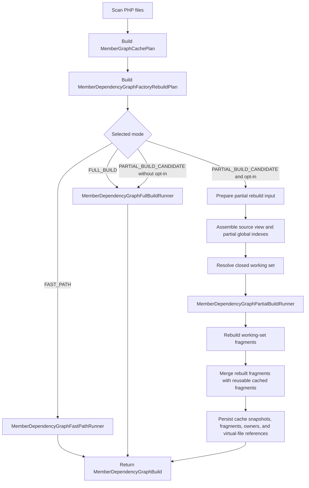

# Partial Rebuild Design

Navigation: [Back to README](README.md) | [Previous: Member Dependency Graph Factory](11-member-dependency-graph-factory.md) | [Next: Topology Service](13-topology-service.md)

This page describes the current partial rebuild path for `MemberDependencyGraphFactory`.

Partial rebuild execution is opt-in through `MemberDependencyGraphFactoryOptions::enablePartialRebuild`.
When the option is disabled, the factory can still expose partial candidate data in `MemberDependencyGraphFactoryBuildReport`, but it runs the full build path.

## Runtime Flow

The factory delegates the three executable paths to dedicated runners:

- `MemberDependencyGraphFastPathRunner`;
- `MemberDependencyGraphFullBuildRunner`;
- `MemberDependencyGraphPartialBuildRunner`.

## Candidate Rules

`MemberDependencyGraphFactoryRebuildPlan` selects `PARTIAL_BUILD_CANDIDATE` when the cache has enough metadata to avoid rebuilding the whole codebase unconditionally.

A partial candidate requires:

- at least one stale, missing, or deleted physical file;
- cached known owners;
- cached virtual-file references;
- a compatible global-index input snapshot;
- a declaration snapshot.

A reusable fresh graph fragment is useful, but it is not mandatory.
The partial path can legitimately rebuild every currently scanned file and still use the cache to remove deleted files and rebuild the graph from a bounded working set.

## Current Guarantees

The current partial rebuild path guarantees:

- changed physical files are parsed through the existing PHPParser-based member graph pipeline;
- deleted physical files are removed from cache payloads and are not loaded into the graph rebuild set;
- impacted reusable fragments are moved into the working set before execution;
- reusable cached fragments are merged only when their physical file is outside the closed working set;
- virtual-file references are refreshed from the virtual files actually rebuilt during partial execution;
- global-index input snapshots are persisted from the post-execution source metadata view;
- declaration snapshots are persisted from the merged partial-compatible declaration view;
- the next unchanged run can use the no-parse fast path after a successful partial build;
- unresolved impacted graph file paths force conservative expansion and diagnostics instead of silent fragment reuse.

The implementation preserves the existing analysis engine.
Declaration snapshots help prepare partial-compatible global indexes, but structured PHPDoc and expression inference still belong to the PHPParser-backed graph build path.

## Working Set Closure

`MemberDependencyGraphPartialRebuildWorkingSetResolver` computes the closed rebuild set.

The resolver starts with:

- files selected by the rebuild plan for parsing;
- deleted files selected by the rebuild plan for cache removal;
- cached fragments that are initially reusable.

It then expands the set by converting changed and removed declarations into impact targets:

- methods;
- functions;
- properties;
- class constants;
- named parameters.

Those targets are resolved against reusable cached fragments through `MemberGraphQueryService`.
Impacted physical files are added to:

- `filesToParseForContext`;
- `filesToRebuildGraph`.

When a newly added impacted file declares members used by other cached fragments, its cached declarations are queued as new impact targets.
The resolver repeats until every queued target has been processed.

If an impacted graph file path cannot be mapped back to a physical file through source metadata, the resolver:

- records `UNRESOLVED_REFERENCE`;
- records `CONSERVATIVE_EXPANSION`;
- adds all remaining reusable fragments to the rebuild set.

This avoids returning a partial graph that silently keeps a stale fragment.

## Partial Execution

`MemberDependencyGraphPartialBuildRunner` executes the closed working set.

It uses `MemberDependencyGraphPartialRebuildExecutor` to:

- load virtual files for `filesToRebuildGraph`;
- build a `MemberDependencyGraph` for those virtual files through the existing builder;
- fragment the rebuilt graph by physical file;
- merge rebuilt fragments with reusable cached fragments.

After execution, the runner persists:

- rebuilt file payloads and fragments;
- removal of deleted file payloads;
- virtual-file references rebuilt from the post-execution source metadata view;
- known owners from the merged graph;
- a refreshed global-index input snapshot;
- the merged declaration snapshot.

## Build Report

`MemberDependencyGraphFactoryBuildReport` is the public debugging boundary for partial rebuilds.

It exposes:

- `buildMode`;
- `cacheLoadResult`;
- `cacheWriteResult`;
- `rebuildPlan`;
- `cachePlan`;
- `loadedVirtualFileCount`;
- `virtualFileReferenceCount`;
- `partialRebuildInput`;
- `partialRebuildWorkingSet`;
- `warnings`.

`loadedVirtualFileCount` counts virtual files, not physical files.
One changed physical file can produce several virtual files when it contains several class-like units.

`virtualFileReferenceCount` reflects the post-build source view.
Deleted files must not leave references behind, and rebuilt files can add or remove several virtual-file references at once.

`cacheLoadResult` and `cacheWriteResult` expose cache initialization and persistence diagnostics.
`warnings` exposes non-blocking factory warnings such as `CACHE_WRITE_FAILED`.

## Cache Snapshots

The partial path uses cacheable snapshots instead of serialized PHPParser nodes.

`MemberGraphGlobalIndexInputSnapshot` stores source metadata required to rebuild owner-level global indexes without reparsing unchanged files.

`MemberGraphDeclarationSnapshot` stores declaration metadata for:

- owners;
- methods;
- functions;
- parameters;
- properties;
- class constants;
- templates.

`MemberGraphPartialGlobalIndexesBuilder` builds the partial-compatible global indexes from source metadata and declaration snapshots.

The current partial-compatible indexes cover:

- known owners;
- polymorphic implementations;
- native property type index;
- class constant owner index;
- scalar class constant value index;
- method return type index;
- method parameter type index;
- function return type index;
- function parameter type index;
- merged declaration snapshot.

Structured callable indexes and inferred structured return indexes are not rebuilt from snapshots.
If a change can invalidate structured analysis outside the changed files, the impacted file must enter the working set and be rebuilt by the existing graph engine.

## Tested Coverage

The partial rebuild tests cover:

- changed declarations expanding to impacted files;
- transitive impacted-file expansion;
- deleted methods, properties, class constants, functions, files, and named parameters;
- replacement scenarios with deleted and added files;
- consecutive partial builds;
- partial build followed by fast path;
- physical files that produce several virtual files;
- deletion of physical files that previously produced several virtual files;
- interface, extended-interface, abstract-parent, indirect-parent, trait, and combined owner metadata transitions;
- structured dispatch transitions for property types, PHPDoc returns, generic `list<T>` returns, nullsafe returns, array shapes, and callable PHPDoc returns;
- conservative expansion when impacted graph file paths cannot be mapped back to physical files.

Navigation: [Back to README](README.md) | [Previous: Member Dependency Graph Factory](11-member-dependency-graph-factory.md) | [Next: Topology Service](13-topology-service.md)
