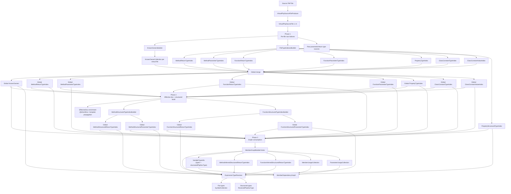

```mermaid
flowchart TD
    A["Source PHP file"] --> B["VirtualPhpSourceFileProducer"]
    B --> C["VirtualPhpSourceFile 1..N"]

    C --> D["Phase 1<br/>Per-file raw indexes"]
    D --> D1["KnownOwnersBuilder"]
    D --> D2["FileTypeIndexesBuilder"]
    D --> D6["Raw parameter/return type sources"]

    D1 --> E1["KnownOwnerCollection per virtual file"]
    D2 --> E2["MethodReturnTypeIndex"]
    D2 --> E3["MethodParameterTypeIndex"]
    D2 --> E4["FunctionReturnTypeIndex"]
    D2 --> E5["FunctionParameterTypeIndex"]
    D2 --> E6["PropertyTypeIndex"]
    D2 --> E7["ClassConstantTypeIndex"]
    D2 --> E8["ClassConstantValueIndex"]
    D2 --> I5["PropertyStructuredTypeIndex"]

    E1 --> F["Global merge"]
    E2 --> F
    E3 --> F
    E4 --> F
    E5 --> F
    E6 --> F
    E7 --> F
    E8 --> F

    F --> G1["Global KnownOwners"]
    F --> G2["Global MethodReturnTypeIndex"]
    F --> G3["Global MethodParameterTypeIndex"]
    F --> G4["Global FunctionReturnTypeIndex"]
    F --> G5["Global FunctionParameterTypeIndex"]
    F --> G6["Global PropertyTypeIndex"]
    F --> G7["Global ClassConstantTypeIndex"]
    F --> G8["Global ClassConstantValueIndex"]

    G1 --> H["Phase 2<br/>Effective doc + structured build"]
    G2 --> H
    G3 --> H
    G4 --> H
    G5 --> H
    G6 --> H
    G7 --> H
    G8 --> H

    H --> H1["EffectiveDoc enrichment<br/>@inheritDoc / template propagation"]
    H --> H2["MethodStructuredTypeIndexBuilder"]
    H --> H3["FunctionStructuredTypeIndexBuilder"]

    H2 --> I1["Global MethodStructuredReturnTypeIndex"]
    H2 --> I2["Global MethodStructuredParameterTypeIndex"]
    H3 --> I3["Global FunctionStructuredReturnTypeIndex"]
    H3 --> I4["Global FunctionStructuredParameterTypeIndex"]

    I1 --> J["Phase 3<br/>Graph consumption"]
    I2 --> J
    I3 --> J
    I4 --> J
    I5 --> J
    G1 --> J
    G2 --> J
    G3 --> J
    G4 --> J
    G5 --> J
    G6 --> J
    G7 --> J
    G8 --> J

    J --> J1["MemberGraphBuilderVisitor"]
    J1 --> J2["ExpressionTypeResolver"]

    J2 --> K1["Flat types<br/>SymbolCollection"]
    J2 --> K2["Structured types<br/>ResolvedPhpDocType"]

    J1 --> K3["VariableTypeInfo<br/>(types + structuredPhpDocType)"]
    J1 --> K4["MethodInferredStructuredReturnTypeIndex"]
    J1 --> K5["FunctionInferredStructuredReturnTypeIndex"]
    J1 --> K6["MemberUsageCollection"]
    J1 --> K7["ParameterUsageCollection"]

    I1 --> J2
    I2 --> J2
    I3 --> J2
    I4 --> J2
    I5 --> J2
    K4 --> J2
    K5 --> J2

    K6 --> Z["MemberDependencyGraph"]
    K7 --> Z
    K3 --> Z
    G1 --> Z
```
